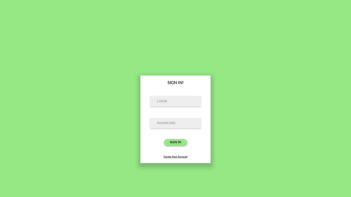
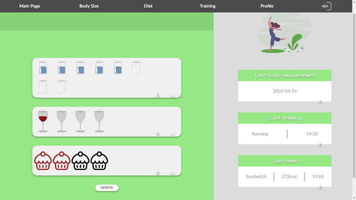
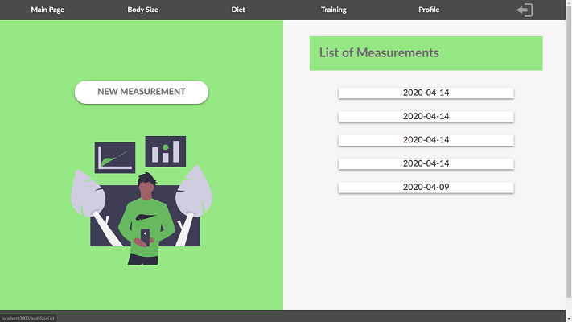
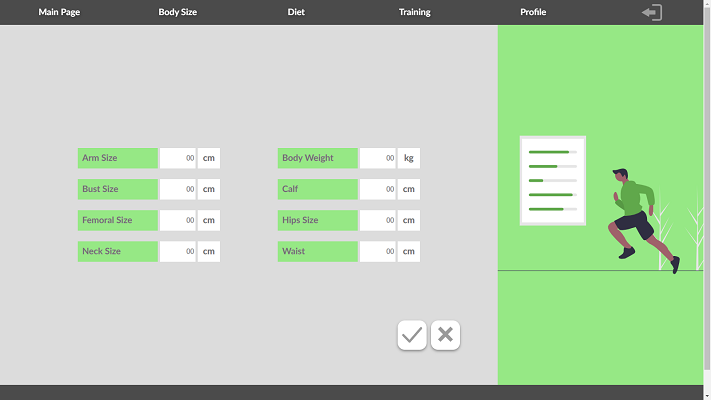

# Health Callendar - Health care progress tracker

> HealthCallendar is an application for people who trains unproffesionaly, the point is to track your progress, or let your trainer be up to date! Project built in cooperation with:( 'here will be the link).

## Table of contents

- [General info](#general-info)
- [Screenshots](#screenshots)
- [Technologies](#technologies)
- [Setup](#setup)
- [Features](#features)
- [Status](#status)

## General info

Project was created for many reasons, first to improve skills, and show the ability to create react applications. We plan to develop new functions in the future and maybe some day get into profitable business.

## Screenshots

## Technologies

- React, React-Dom - version 16.10.2
- react-redux - version 7.1.3
- redux - version 4.0.5
- redux-thunk - version 2.3.0
- styled-components - version 4.4.0
- react-router, react-router-dom - version 5.1.2
- @storybook/react - version 5.2.4

## Setup

### Instalation

Open terminal in project folder and type:

> npm install

### Running

Type:

> npm start

It will be opened in your default tnternet browser.

Or you can check here: (here will be the link).

## Features

List of features ready and TODOs for future development

- Creating accounts.
- You can upload your body measurements, trainings and meals.
- You can check your previous body measurements to track your progress.

To-do list:

- Minor fixes of Styles
- Optimize communication with API
- Correct whole HTML semantics

## Status

Project still in progress.
